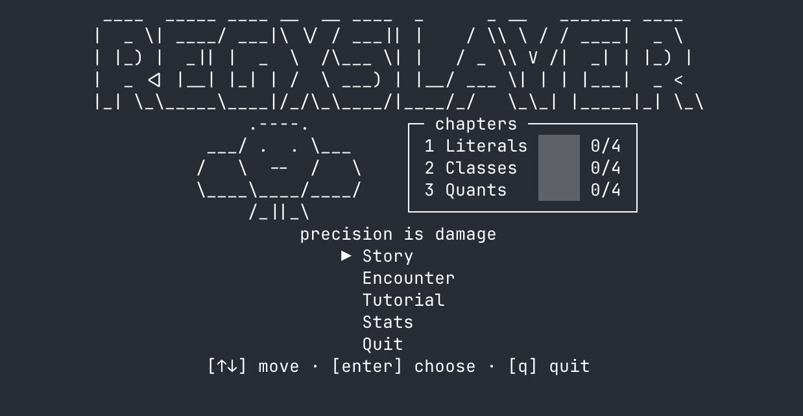

# regxslayer

A terminal regex-practice game. Each monster is a layered text body — write a
regex that surgically matches the right strings to peel layers, then strike the
heart for the kill.



## Modes

- **Story** — 3 chapters of 4 monsters each. Unlocks chapter-by-chapter as you
  slay your first monster in each chapter.
- **Encounter** — endless random monsters drawn from the story + wild pools.
  Slay one, the next appears immediately. Press `esc` to flee back to the menu.
- **Tutorial** — a small set of teaching monsters (Lump, Pip, Bop) with inline
  coaching text. Replayable. Tutorial activity does not feed practice stats.
- **Stats** — practice breakdown across 15 regex traits. Highlights traits
  you've never touched and traits where your perfect-strip rate is low. The
  reset key (`r`) zeros the practice numbers without wiping story progress.

## Install

Requires [Bun](https://bun.sh).

```bash
bun install
bun run dev
```

To build a standalone binary (no Bun required at runtime):

```bash
bun run build
./dist/regxslayer
```

## Controls

- Type to write your regex. Highlights and damage update on every keystroke.
- A layer auto-strips when your regex matches **only** its vital lines.
- `tab` — toggle hint cheatsheet for the current chapter (tab never appears in a regex pattern, so it doesn't collide with what you might type)
- `esc` — flee combat (back to mode-specific select) or close hints
- `↑`/`↓`/`⏎` — navigate menus
- `Ctrl-C` — quit

## Saves

Progress is saved to `~/.regxslayer/save.json` (or
`$XDG_DATA_HOME/regxslayer/save.json` on Linux when set). v1 saves migrate
forward automatically. Slay one monster in a chapter to unlock the next chapter.

## No telemetry

regxslayer is fully offline. It opens no network sockets.

## Built with

regxslayer's TUI is built on [gridland](https://github.com/thoughtfulllc/gridland) —
a React renderer for terminal grids. The `@gridland/bun` runtime drives the
render loop and `@gridland/utils` provides the keyboard hook, terminal
dimensions, and the `<scrollbox>` primitive used across every screen.
